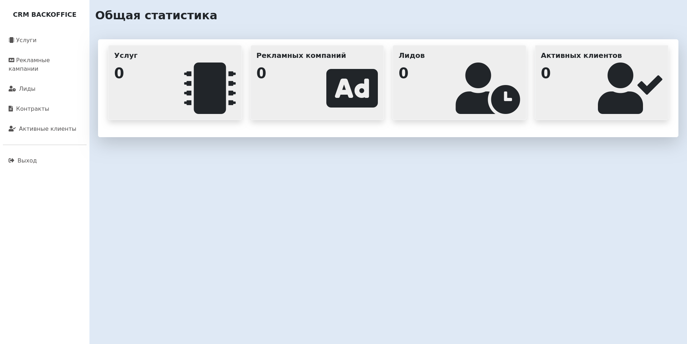
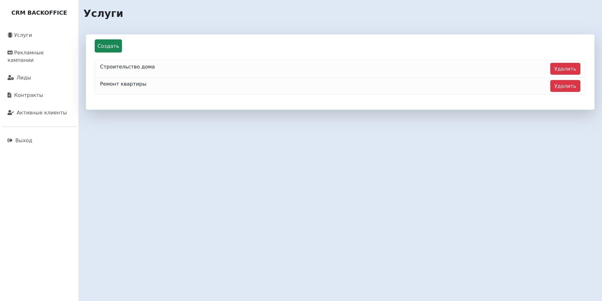
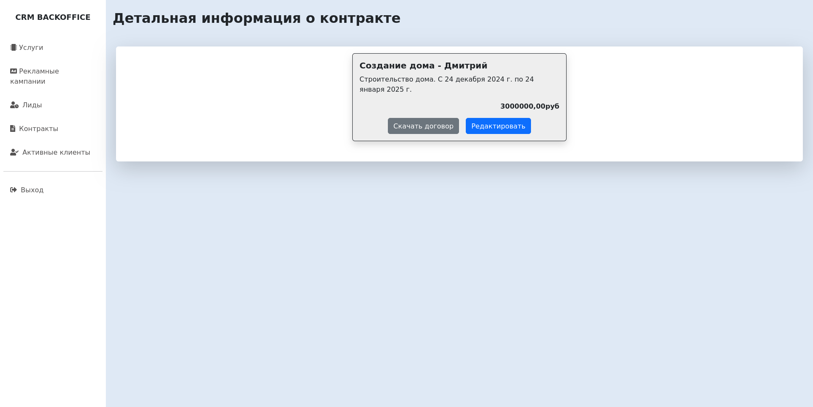
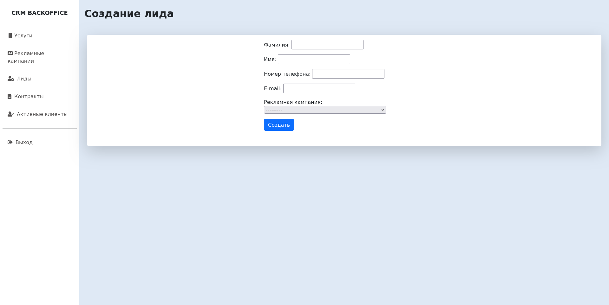

# CRM Business
Исполнитель: **Юрий Кожанов**

---

## Описание проекта
CRM-система, позволяющая сотрудникам:
* вести учёт предлагаемых компанией услуг;
* запускать и завершать рекламные кампании;
* учитывать потенциальных клиентов, которые заинтересовались конкретной рекламной кампанией;
* переводить клиентов из статуса «потенциальные» в статус «активные» при составлении контрактов на сотрудничество. 

Это Django-проект, он не теряет данные между перезапусками.

## Содержание
- [Установка](#установка-и-запуск)
- [Использование](#использование)
- [Используемые инструменты](#используемые-инструменты)
- [Примеры работы сервиса](#примеры-работы-сервиса)
- [Контакты](#контакты)


## Установка и запуск
### Шаг 1: Предварительная настройка
Перед использованием приложения убедитесь, что на Вашем устройстве (Linux-based OS) установлен **Python 3.13**

### Шаг 2: Клонируйте репозиторий
Клонируйте gitlab репозиторий на Ваше устройство:
```bash
git clone https://github.com/ykozhanov/CRMBusiness.git
```

### Шаг 3: Подготовка виртуального окружения
- Перейдите в директорию с репозиторием:
```bash
cd CRMBusiness 
```
- Создайте виртуальное окружение:
```bash
python -m venv .venv
```
- Запустите виртуальное окружение:
```bash
source .venv/bin/activate
```
- Установите poetry:
```bash
pip install poetry==1.8.5
```
- Установите необходимые зависимости:
```bash
poetry install
```

### Шаг 4: Установка переменных окружения
Создайте `.env` файл с переменными. Для примера используйте `.env-example` из репозитория.

### Шаг 5: Запуск приложения
- Перейдите в директорию с приложением:
```bash 
cd crmbusiness
```
- Для запуска выполните в терминале: 
```bash 
python manage.py runserver
```


## Использование

### Шаг 1: Создание администратора
- В той же директории (crmbusiness) выполните команду:
```bash
python manage.py createsuperuser
```
- Вас попросят придумать логин, ввести почту, придумать надежный пароль и еще раз повторить его. **Используйте надёжный пароль**!
- В интернет-браузере откройте http://localhost:8000/, чтобы открыть главную страницу.

### Шаг 2: Создание ролей
- Войдите в административную панель http://localhost:8000/admin/ используя логин и пароль, который вы устанавливали для администратора.
- Перейдите на вкладку *Группы* в разделе *Пользователи и группы*.
- Нажмите *Добавить группу* в верхней правой части экрана.
- На открывшейся странице вы можете создавать роли.
  - **Ads | advertising** - управление рекламными кампаниями;
  - **Contracts | contract** - Управление договорами;
  - **Customers | customer** - Управление активными клиентами;
  - **Leads | lead** - Управление лидами;
  - **Products | product** - Управление услугами.
- Рекомендуемые роли:
  - **Администратор** может создавать, просматривать и редактировать пользователей, назначать им роли и разрешения. Такой функционал реализует административная панель Django.
  - **Оператор** может создавать, просматривать и редактировать потенциальных клиентов. 
  - **Маркетолог** может создавать, просматривать и редактировать предоставляемые услуги и рекламные кампании. 
  - **Менеджер** может создавать, просматривать и редактировать контракты, смотреть потенциальных клиентов и переводить их в активных.
- Так же в административной панели можно создать каналы продвижения для дальнейшего использования в рекламных кампаниях.

### Шаг 3: Создание пользователей
- Войдите в административную панель http://localhost:8000/admin/ используя логин и пароль, который вы устанавливали для администратора.
- Перейдите на вкладку *Пользователи* в разделе *Пользователи и группы*.
- Нажмите *Добавить пользователя* в верхней правой части экрана.
- Создайте пользователя и наделите его какой-либо ролью из созданных ранее.


## Используемые инструменты
- [Python](https://www.python.org/) как основной язык программирования;
- [Django](https://www.djangoproject.com/) как основной фраймворк;
- [SQLite](https://www.sqlite.org/index.html) как база данных;


## Примеры работы сервиса

### Пример 1: Окно общей статистики


### Пример 2: Окно списка услуг


### Пример 3: Окно детальной информции о контракте


### Пример 4: Окно создания лида


## Контакты
По вопросам проекта и другим вопросам связанным с используемыми в проекте инструментам 
можно писать на почту `ykozhanov97@gmail.com`